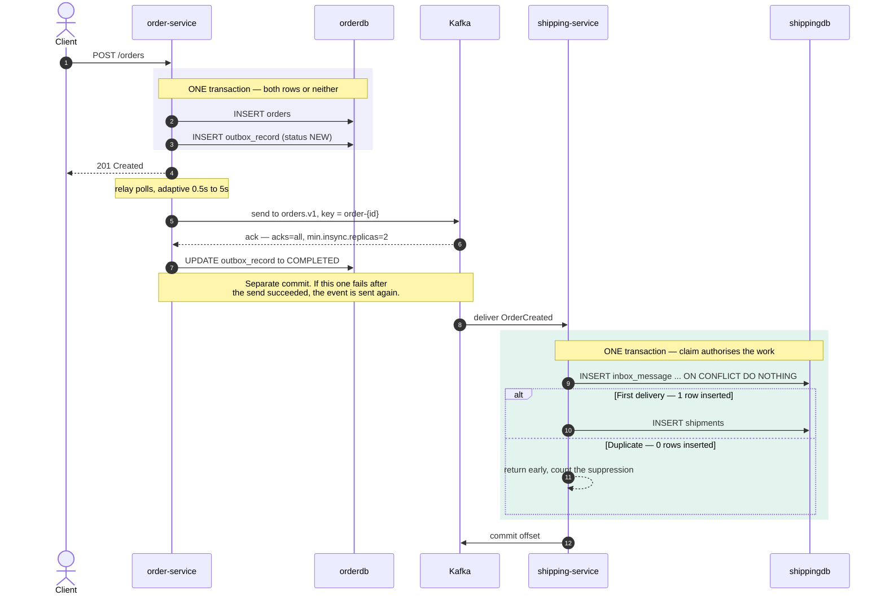

# Transactional Outbox + Idempotent Inbox

A runnable POC on **Java 25 / Spring Boot 4.1.1 / Confluent Kafka 8.2.2 (KRaft)** that demonstrates
reliable asynchronous messaging end to end:

- **Outbox** — a business write and its event commit in one database transaction, then a background
  relay ([namastack-outbox](https://github.com/namastack/namastack-outbox)) publishes to Kafka. An
  event is never lost, even if Kafka is unreachable at commit time.
- **Inbox** — the consumer deduplicates redeliveries, turning at-least-once transport into
  effectively-once processing.
- **Observability** — Conduktor for Kafka inspection, Prometheus + Grafana for outbox backlog,
  suppressed duplicates, and consumer lag.

---

## Why an inbox module exists here

namastack-outbox is a mature answer to the producer side. There is **no equivalent inbox starter for
Spring Boot 4** — namastack ships outbox only, and the sole first-party alternative is Spring
Integration's `IdempotentReceiverInterceptor` + `JdbcMetadataStore`, which pushes you into channel
adapters rather than plain `@KafkaListener`.

So [`inbox-support`](inbox-support) is a small, auditable module (~5 classes) built on one idea:

```sql
INSERT INTO inbox_message (event_id, consumer, ...) VALUES (...)
ON CONFLICT (event_id, consumer) DO NOTHING
```

The check and the write are a single statement, so concurrent deliveries of the same event are
resolved by the database. A `SELECT`-then-`INSERT` would leave a window where two threads both
conclude "not yet processed" — not hypothetical, since a rebalance or redelivery can land the same
event on two threads at once.

---

## Architecture

The two shaded blocks are the whole design; everything else is plumbing.



**[→ Full diagrams](docs/architecture.md)** — failure modes, container topology, and which metric
answers which question.

### Where the guarantees come from

1. `outbox.schedule()` writes inside the business transaction, so the event and the order are atomic.
   A rollback discards both — which is correct.
2. The relay calls `kafkaOperations.send(record).get()`, blocking on the broker acknowledgement. With
   `acks=all` and `min.insync.replicas=2`, a returned send means the event is durably replicated.
3. Marking the record `COMPLETED` is a **separate** commit. If that fails after a successful send,
   the record is re-sent later — a genuine duplicate on the topic. This is inherent to at-least-once
   and cannot be designed away without distributed transactions.
4. The inbox absorbs (3). `eventId` lives in the **payload** and is generated inside the producer's
   transaction, so every replay of a stored record carries an identical id. The composite primary key
   makes the second delivery a no-op.

> `OutboxRecordMetadata` exposes `key`, `handlerId`, `createdAt`, `context`, `failureCount`,
> `attempt`, `isRetry` — but **not** the outbox record id. The idempotency key therefore has to be
> part of the payload. That is the better design anyway: the event id becomes part of the published
> contract instead of leaking infrastructure state.

---

## Version matrix

| Component | Version | Note |
|---|---|---|
| Java | 25 | Records, sealed interfaces, virtual threads |
| Spring Boot | **4.1.1** | Matches namastack's own baseline exactly |
| namastack-outbox | **1.9.0** | BOM + `starter-jpa`, `kafka`, `metrics`, `observability`, `actuator` |
| kafka-clients / spring-kafka | 4.2.1 / 4.1.1 | Managed by Boot |
| Jackson | 3.1.5 | Jackson **3** (`tools.jackson.*`) is the Boot 4 default |
| Flyway / PostgreSQL JDBC | 12.4.0 / 42.7.13 | Managed by Boot |
| Testcontainers | 2.0.5 | 2.x renamed every module with a `testcontainers-` prefix |
| Confluent Platform | 8.2.2 | KRaft only — ZooKeeper removed in CP 8.0 |
| Conduktor Console / Cortex | 1.46.2 | Free plan; needs two databases |
| Prometheus / Grafana | v3.13.1 / 13.1.1 | |
| kafka-exporter | v1.9.0 | Consumer lag without JMX plumbing |

`namastack-outbox-starter-jpa` bundles only `api`, `core`, `jpa`, `jackson`. The Kafka integration and
all three observability modules must be declared explicitly — see [order-service/pom.xml](order-service/pom.xml).

---

## Prerequisites

Only **Docker** is required. There is no need for a local JDK or Maven: the service images build
themselves, and `./mvnw` uses the `only-script` wrapper distribution, which downloads Maven on first
use.

---

## Running

Start with the core stack — 8 containers, the 3-broker cluster, Schema Registry, Postgres and both
services. This is enough for every demo in the walkthrough below:

```bash
docker compose up -d --build
```

Prometheus, Grafana and kafka-exporter add three light containers:

```bash
docker compose --profile metrics up -d
```

Conduktor Console adds three heavier ones (Console, Cortex, and its own Postgres):

```bash
docker compose --profile ui up -d
```

> **Memory limits here are load-bearing, not decorative.** Every service that runs a JVM has an
> explicit `deploy.resources.limits.memory`, because the app images set `-XX:MaxRAMPercentage` and
> without a limit that percentage applies to the *whole Docker VM* — order-service was measured
> holding 2.4 GB before the limit was added. Broker heaps are likewise capped at 512 MB each
> (Confluent's default is 1 GB apiece, 3 GB for the quorum). With those caps the full stack settles
> at roughly 6 GB. On a Docker Desktop given 8 GB or less, still bring the profiles up one at a time
> and let each settle; the whole set starting at once was enough to wedge the daemon during
> development.

| Endpoint | URL | Credentials |
|---|---|---|
| order-service | http://localhost:8090 | |
| shipping-service | http://localhost:8091 | |
| Outbox purge (DELETE only) | `DELETE /actuator/outbox/{status}` | see note below |
| Conduktor Console | http://localhost:8080 | `admin@demo.io` / `Admin123!` |
| Grafana → "Inbox / Outbox" | http://localhost:3000 | `admin` / `admin` |
| Prometheus | http://localhost:9090 | |
| Schema Registry | http://localhost:8081 | |

All three brokers always start: the KRaft controller quorum has 3 voters and needs 2 to elect a
leader, so a single broker would never form a quorum.

---

## Demo walkthrough

### 1. Happy path

```bash
curl -s -X POST localhost:8090/orders -H 'Content-Type: application/json' -d '{"customerId":"CUST-7","totalAmount":149.90}'
```

```bash
curl -s localhost:8091/inbox
```

One shipment, one inbox claim. The message is visible on `orders.v1` in Conduktor.

### 2. Outbox durability — the core proof

Stop every broker, then place an order:

```bash
docker compose stop kafka-1 kafka-2 kafka-3
```

```bash
curl -i -X POST localhost:8090/orders -H 'Content-Type: application/json' -d '{"customerId":"CUST-9","totalAmount":42.00}'
```

**Still returns 201.** The business transaction committed; the event is safe in `outbox_record` with
`status = NEW` and a climbing `failure_count`:

```bash
docker exec -it app-postgres psql -U demo -d orderdb -c "SELECT record_key, status, failure_count FROM outbox_record ORDER BY created_at DESC LIMIT 5;"
```

The Grafana "Outbox backlog" panel shows the same thing without SQL. Note that
`namastack-outbox-actuator` declares only `@DeleteOperation`s, so there is no `GET /actuator/outbox`
to inspect — it is a purge tool, not a viewer.

Bring the cluster back and the backlog drains on its own — no manual replay, nothing lost:

```bash
docker compose start kafka-1 kafka-2 kafka-3
```

### 3. Inbox deduplication

Replay an order's original event through the real outbox and Kafka path:

```bash
curl -s -X POST localhost:8090/demo/duplicate/ORD-XXXXXXXX
```

`totalClaims` and `shipments` from `GET :8091/inbox` are unchanged, and the suppression is counted:

```bash
curl -s localhost:8091/actuator/prometheus | grep inbox_messages
```

In Grafana, "Duplicates suppressed vs. events processed" shows the orange line move.

### 4. Retry and dead-lettering

`CUST-POISON` makes the handler throw on purpose:

```bash
curl -s -X POST localhost:8090/orders -H 'Content-Type: application/json' -d '{"customerId":"CUST-POISON","totalAmount":1.00}'
```

Three retries one second apart, then the record lands on `orders.v1.DLT` (visible in Conduktor).
Critically, **no `inbox_message` row is committed** — the claim rolled back with the transaction, so
the event was never falsely marked as handled.

### 5. Ordering

Cancelling reuses the `order-<id>` outbox key, so create-then-cancel for one order is relayed
sequentially and lands on the same Kafka partition:

```bash
curl -s -X POST "localhost:8090/orders/ORD-XXXXXXXX/cancel?reason=changed-mind"
```

---

## Building and testing without Docker Compose

```bash
./mvnw verify
```

---

## Notes and trade-offs

**Two harmless log lines you will see.** Conduktor's ACL indexer logs
`SecurityDisabledException: No Authorizer is configured on the broker` every cycle — expected on a
PLAINTEXT dev cluster with no authorizer, and unrelated to the demo. Its Schema Registry indexer also
reports `0 schemas, 0 subjects`, which is correct for the serialization choice described next.

**Serialization.** `namastack.outbox.kafka.enable-json: true` contributes Spring Kafka's
`JacksonJsonSerializer`/`JacksonJsonDeserializer` — that is **plain Jackson 3 JSON**, without
Confluent's 5-byte magic + schema-id envelope. Conduktor renders the messages correctly but cannot
associate a registry schema. Schema Registry runs in the stack and is wired into Conduktor so the
upgrade path is short: swap the producer's `value-serializer` for Confluent's
`KafkaJsonSchemaSerializer` (add the `packages.confluent.io` repository) with no change to outbox or
inbox logic.

**Class-name coupling.** `spring.json.type.mapping` maps logical aliases (`orderCreated`) to classes
on each side, so the wire format carries no Java FQCNs and the services can evolve their internal
package layout independently.

**Retention is the dedup window.** `demo.inbox.cleanup.retention` (default 7 days) bounds the
`inbox_message` table. Anything redelivered after it is processed again, so it must stay comfortably
above the topic's own retention. An unbounded ledger is a slow-motion outage; a too-short one
silently reopens the duplicate window.

**Outbox growth.** `delete-completed-records: false` keeps rows visible for the demo. Production needs
either `true` or a scheduled purge. `namastack-outbox-actuator` gives you the manual lever — it
exposes purge operations only, no read:

```bash
curl -X DELETE localhost:8090/actuator/outbox/COMPLETED
```

That returns `204` and clears every completed record, leaving `orders` untouched. There is also
`DELETE /actuator/outbox/{recordKey}/{status}` for a single ordering key.

**`@EntityScan` in libraries.** `inbox-support` deliberately does *not* declare `@EntityScan` or
`@EnableJpaRepositories`: either annotation replaces Boot's defaults wherever it appears, so a library
declaring them would stop the *application's* own entities from being discovered. The consuming
application owns that declaration — see
[ShippingServiceApplication](shipping-service/src/main/java/com/demo/shipping/ShippingServiceApplication.java).

**Java/Kotlin interop.** namastack is Kotlin but Java-friendly: `@JvmStatic` factories and
`BiFunction`/`Consumer` overloads. One sharp edge: `KafkaOutboxRouting.Builder.route`/`defaults`
expose *both* the Kotlin `Function1` and the `Consumer` overload without `@JvmSynthetic`, so from Java
an expression lambda is ambiguous. Use a block-bodied lambda — see the comment in
[KafkaOutboxRoutingConfig](order-service/src/main/java/com/demo/order/config/KafkaOutboxRoutingConfig.java).

**Spring Boot 4 package moves.** Modularization relocated several classes:
`org.springframework.boot.hibernate.autoconfigure.HibernateJpaAutoConfiguration`,
`org.springframework.boot.persistence.autoconfigure.EntityScan`, and
`org.springframework.boot.kafka.autoconfigure.*` (which needs an explicit `spring-boot-kafka`
dependency).

---

## Layout

```
├── common-events/      shared contracts (sealed OrderEvent, records)
├── inbox-support/      reusable idempotent-consumer module
├── order-service/      outbox producer  :8090
├── shipping-service/   inbox consumer   :8091
└── docker/             kafka topic init, postgres init, prometheus, grafana
```
