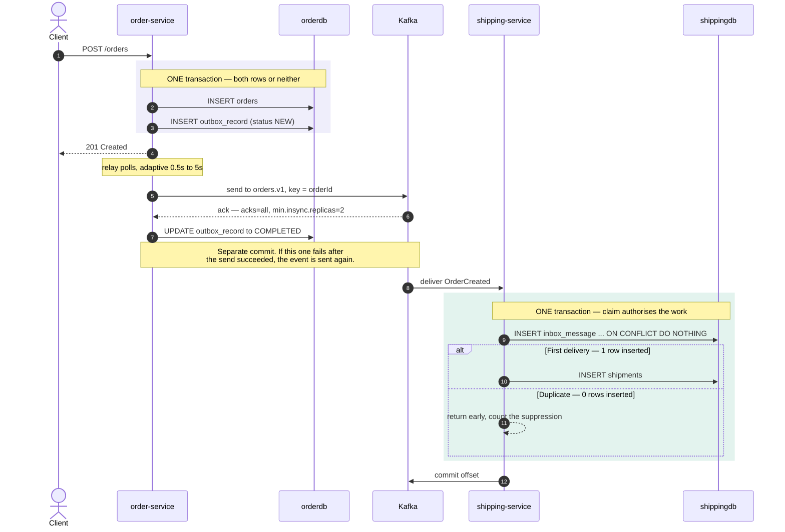
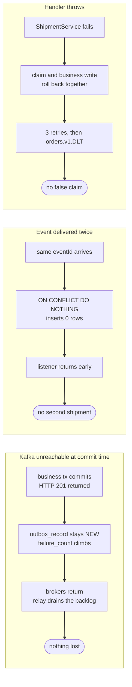
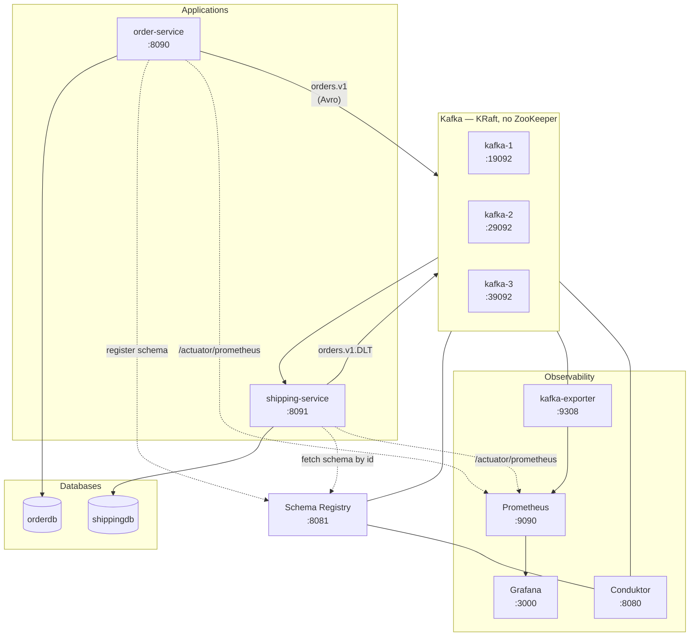

# Architecture

Three views of the same system: the end-to-end flow, what happens when it breaks, and what actually
runs in Docker. All diagrams are Mermaid, so they render on GitHub without any build step.

---

## 1. End-to-end flow

The two shaded blocks are the whole design. Everything else is plumbing.

Why each step matters:

- **Steps 2–3** are why nothing is lost. The event is not a side effect of the business write; it is
  part of the same commit.
- **Step 4** returns before publication. A `201` means *durably recorded and guaranteed to publish*,
  not *already on the topic*.
- **Steps 5–6** are a blocking send: the relay waits for the broker acknowledgement, so with
  `acks=all` and an ISR floor of 2 the ack means genuinely replicated.
- **Step 7** is a *second* commit, and that is the unavoidable gap — see the note that follows it.
- **Steps 9–11** close that gap. The claim and the business write share one transaction, so the
  system can never be in a state where work happened but was not recorded as having happened.

The idempotency key is `eventId`, carried **in the payload** and generated inside the producer's
transaction. The outbox stores the domain record once; at relay time the routing maps it to its Avro
`SpecificRecord` (a pure function of the stored record) and `KafkaAvroSerializer` writes it, so every
retry or replay produces identical bytes and an identical id.

---

## 2. What happens when it breaks

The third column is the subtle one. If the claim survived a rolled-back handler, the event would be
permanently marked as processed and silently dropped — the retry would be mistaken for a duplicate.
Rolling the claim back with the transaction is what keeps failures recoverable.

Two guardrails make these properties hard to break by accident:

- `InboxGuard.claim` is `@Transactional(propagation = MANDATORY)`, so calling it outside a
  transaction fails loudly instead of committing a claim on its own.
- The dedup insert is a single statement. A `SELECT`-then-`INSERT` would leave a window where two
  concurrent deliveries both conclude "not processed yet"; here the loser of the race gets 0 rows
  back from the database itself.

---

## 3. What runs in Docker

`orderdb` and `shippingdb` are separate databases in one Postgres instance. Each service owns its own
schema and migrations, with no shared tables and no cross-service joins — that separation is the
reason these patterns are needed at all.

All three brokers are always-on by design: the KRaft controller quorum has three voters and needs two
to elect a leader, so a single broker would never form a quorum. `RF=3` topics and
`min.insync.replicas=2` depend on all three as well.

---

## 4. Where the numbers come from

The metrics behind the Grafana dashboard, and which side of the system each one tells you about:

| Signal | Metric | Answers |
|---|---|---|
| Outbox backlog | `outbox_records{outbox_record_status="new"}` | Is the producer stuck? |
| Publish latency | `outbox_record_process_seconds_bucket` | Is the relay slow? |
| Consumer lag | `kafka_consumergroup_lag` | Is the consumer behind? |
| Duplicates suppressed | `inbox_messages_duplicate_total` | Is the inbox earning its keep? |
| Events processed | `inbox_messages_processed_total` | Throughput of real work (counted on commit, so a rolled-back attempt never shows) |

Backlog and lag answer genuinely different questions, which is why both are on the dashboard: a
backlog means the event never reached Kafka, while lag means it did and the consumer has not caught
up. Confusing the two sends you debugging the wrong service.
