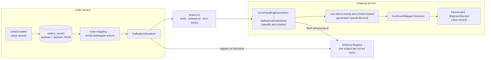

# Avro + Schema Registry instead of plain Jackson JSON

What changed when the Kafka wire format moved from Spring Kafka's `JacksonJsonSerializer` to
Confluent Avro, why each piece is there, and where to look when something breaks. The outbox and
inbox mechanics are untouched; this is a serialization-layer change with a few knock-on effects.

---

## 1. The shape of the change



Two representations of every event now exist on purpose:

| | Java record (`com.demo.events.OrderCreated`) | Avro class (`com.demo.events.avro.OrderCreated`) |
|---|---|---|
| Defined by | hand-written record in `common-events` | `common-events/src/main/avro/OrderCreated.avsc`, code generated at build |
| Used by | business code, `@OutboxEvent`, the outbox table | Kafka serializer/deserializer, `@Payload` parameters |
| Stored where | `outbox_record.payload` as Jackson JSON, keyed by FQCN in `record_type` | Kafka topics, Schema Registry subjects |

The bridge is [`AvroEventMapper`](../common-events/src/main/java/com/demo/events/avro/AvroEventMapper.java),
a pair of pure functions. The alternative — making the generated Avro classes the domain events —
was rejected: generated code cannot carry `@OutboxEvent`, Jackson would need mix-ins to store a
`SpecificRecordBase` in the outbox table, and every `record_type` already in the table would change.

---

## 2. Key additions, file by file

### Contracts and codegen — `common-events`

- **`src/main/avro/OrderCreated.avsc`, `OrderCancelled.avsc`** — the published contracts. Namespace
  `com.demo.events.avro`; `totalAmount` is `bytes` with logical type `decimal(12,2)` to mirror the
  `NUMERIC(12,2)` columns; `occurredAt` is `long` with `timestamp-millis`. Field `doc` strings carry
  the semantics (eventId is the inbox idempotency key) into the registry, where consumers read them.
- **`pom.xml`** — `avro-maven-plugin` (`schema` goal at `generate-sources`) with two settings that
  matter: `stringType=String` so fields are `java.lang.String` rather than `CharSequence`/`Utf8`, and
  `enableDecimalLogicalType=true` so the decimal becomes `BigDecimal` rather than `ByteBuffer`.
  The parent pom pins `avro.version` once so the runtime jar in every module matches the generator.
- **`AvroEventMapper`** — `toAvro(Object)` is an exhaustive switch over the sealed `OrderEvent`;
  anything else fails with a message naming the class instead of the serializer's opaque
  "Unsupported Avro type". `toAvro(OrderCreated)` rescales the amount to scale 2 because Avro's
  decimal conversion rejects a scale mismatch rather than rounding (REST input `149.9` has scale 1).
- **`AvroTrust`** — see §4. Registers the generated classes with Avro's class allow-list.

### Producer — `order-service`

- **`application.yml`**
  - `namastack.outbox.kafka.enable-json: false`. The default `true` imports a jar-internal property
    source that sets `JacksonJsonSerializer` as the producer value serializer. Turning it off is what
    makes the wire format an explicit decision in this file.
  - `spring.kafka.producer.value-serializer: io.confluent.kafka.serializers.KafkaAvroSerializer`.
  - `spring.kafka.properties.schema.registry.url` — under the **common** key, not
    `producer.properties`. Boot merges `spring.kafka.properties.*` into producer, consumer and admin
    configs, so one key serves every client and one `SPRING_KAFKA_PROPERTIES_SCHEMA_REGISTRY_URL` env
    var overrides it in compose. A producer-scoped copy would silently win over the compose value.
  - `spring.json.type.mapping` is gone: the schema's full name is the type contract now.
  - `value.subject.name.strategy: RecordNameStrategy` on the producer (and on the dead-letter producer in `shipping-service`), because `orders.v1` and `orders.v1.DLT` each carry two record types. The consumer needs no setting: it reads the schema id from the payload.
- **`KafkaOutboxRoutingConfig`** — `route.mapping((payload, metadata) -> AvroEventMapper.toAvro(payload))`
  on the single order route and on `defaults`. namastack resolves topic, key and headers from the *original*
  payload and only then applies the mapping, so those lambdas still see the domain record. Because
  the mapping is deterministic, a retried or replayed outbox row produces byte-identical Avro, which
  is the property the consumer's inbox depends on.
- **`OrderController`** — `@Digits(integer = 10, fraction = 2)` on the amount. An amount the schema
  cannot encode is a 400 at the API instead of an outbox row that fails on every relay attempt.

### Consumer — `shipping-service`

- **`application.yml`**
  - `spring.deserializer.value.delegate.class: io.confluent.kafka.serializers.KafkaAvroDeserializer`
    behind the existing `ErrorHandlingDeserializer`, so a corrupt payload or an unknown schema id
    still becomes a dead letter rather than a stuck partition.
  - `specific.avro.reader: true` materialises records into the generated classes (resolved by the
    schema's full name) instead of `GenericRecord`, so `@Payload` parameters stay typed.
  - `spring.json.trusted.packages` and `spring.json.type.mapping` removed; `producer.value-serializer`
    removed (see next point).
- **`KafkaConsumerConfig`** — a hand-built `ProducerFactory`/`KafkaTemplate` for the dead-letter
  publisher, using `DelegatingByTypeSerializer`: `byte[]` → `ByteArraySerializer` (deserialization
  failed, republish the original bytes untouched), `SpecificRecord` → `KafkaAvroSerializer` (listener
  threw on a valid event). A single Avro serializer cannot take the `byte[]` shape, and
  `DelegatingByTypeSerializer` has no property-based configuration. Declaring the factory makes
  Boot's own back off, which also drops its `@ServiceConnection` handling — hence the bean reads
  `KafkaConnectionDetails` itself so Testcontainers still works.
- **`OrderEventListener`** — one `onOrderEvent(@Payload SpecificRecord payload, ...)` for both types, then
  `OrderEvent event = AvroEventMapper.fromAvro(payload)` on the first line. Everything after is the
  unchanged claim-then-act sequence.

### Build, infrastructure, tests

- **Parent `pom.xml`** — `packages.confluent.io/maven` repository (Confluent artefacts are not on
  Central), `kafka-avro-serializer` 8.2.2 to match the `cp-*:8.2.2` images (CP 8.2 ↔ Kafka 4.2, the
  line Boot pins `kafka-clients` to), `avro` 1.12.2. Confluent brings Jackson 2 with it; Boot 4
  manages that version too, and it coexists with the Jackson 3 used for REST and the outbox table.
- **`docker-compose.yml`** — both services `depends_on: schema-registry (service_healthy)` and get
  `SPRING_KAFKA_PROPERTIES_SCHEMA_REGISTRY_URL: http://schema-registry:8081`. The registry container
  itself was already there, wired into Conduktor.
- **Tests** — `schema.registry.url: mock://<scope>` in both `application-test.yml` files. Confluent's
  `mock://` scheme backs the serde with an in-JVM `MockSchemaRegistryClient` shared by every client
  using the same scope, so the real `KafkaAvroSerializer` runs against the Testcontainers broker
  with no registry container. `OutboxAtomicityTest` is unchanged and now proves the Avro producer
  path (COMPLETED is only written after the broker ack). `AvroConsumerIntegrationTest` is new: it
  publishes Avro through the app's own template, asserts one shipment and one claim for two
  deliveries, and proves the dead letter for a poison event starts with Confluent's magic byte.
  `AvroEventMapperTest` covers the binary round trip of the logical types.

---

## 3. What you see at runtime

```bash
curl -s localhost:8081/subjects
```

`orders.v1` carries both event types, so the producer uses `RecordNameStrategy` (subject = the record's full name) rather than the default topic-name strategy, which would register both schemas under one subject and fail the second. Subjects are auto-registered on first use:

| Subject | Appears after |
|---|---|
| `com.demo.events.avro.OrderCreated` | first order |
| `com.demo.events.avro.OrderCancelled` | first cancellation |

```bash
curl -s localhost:8081/subjects/com.demo.events.avro.OrderCreated/versions/latest | jq -r .schema | jq .
```

```bash
docker exec schema-registry kafka-avro-console-consumer --bootstrap-server kafka-1:9092 --topic orders.v1 --from-beginning --property schema.registry.url=http://localhost:8081
```

Each message on the topic is `0x00`, a 4-byte schema id, then Avro binary. Conduktor shows the
schema next to the topic and decodes messages through it. The registry was started with
`SCHEMA_REGISTRY_SCHEMA_COMPATIBILITY_LEVEL: backward`, so a new schema version that an old reader
could not decode is rejected at registration — i.e. the producer's relay attempt fails and the outbox
row retries, rather than a bad contract reaching consumers.

---

## 4. Traps met on the way

**Avro's class allow-list.** Avro ≥ 1.12.1 runs every `Class.forName` it performs through
`ClassSecurityValidator`, whose allow-list is empty by default. `KafkaAvroDeserializer` with
`specific.avro.reader` resolves the writer schema's full name to a class exactly that way, so the
very first record fails with
`SecurityException: Forbidden com.demo.events.avro.OrderCreated! This class is not trusted…`.
[`AvroTrust.trustEventSchemas()`](../common-events/src/main/java/com/demo/events/avro/AvroTrust.java)
extends the global predicate with the two generated classes and is called from a `static {}` block
in `KafkaConsumerConfig` and from the mapper test. The alternative is
`-Dorg.apache.avro.SERIALIZABLE_PACKAGES=com.demo.events.avro` on every affected JVM.

*Who is affected.* The check fires on the schema-to-class lookup, and only there. A producer is
unaffected against a real registry: `KafkaAvroSerializer` works from the record instance it is handed and does not resolve a
class by name. The `mock://` registry the tests use does (it looks the class up on every send), which is why order-service calls `AvroTrust` too. A consumer using
`GenericRecord` instead of the specific reader is also unaffected — `GenericRecord` does not
instantiate your generated class at all, so there is no class-name lookup to trust or block.

So the practical rule: any JVM that deserializes *into your generated classes* — real consumers with
`specific.avro.reader=true`, but also test runners, local dev setups, and anything else that exercises
that deserialization path (integration tests, a Kafka Streams app reading its own topic, a REST proxy
configured for specific Avro, and so on) — needs either the JVM flag or the equivalent code
(`AvroTrust.trustEventSchemas()`, or whatever you land on) applied to it. A JVM that only produces,
or only reads generically, does not.

That narrows the "every JVM must carry the flag" objection above: it is specifically every JVM that
runs specific-reader deserialization, which in practice is the consumer fleet plus its test suite,
not the whole system. Doing it in code still wins for the POC because the consumer and its tests are
exactly the JVMs that are easiest to forget a flag on.

**Decimal scale is exact, not rounded.** `Conversions.DecimalConversion` throws when the
`BigDecimal`'s scale differs from the schema's. Normalise before building the record (the mapper
does) and validate precision at the API boundary.

**`timestamp-millis` truncates.** `Instant.now()` on Java 25 carries microseconds; the wire format
does not. Tests compare with `truncatedTo(ChronoUnit.MILLIS)`.

**The DLT publishes two shapes.** See `KafkaConsumerConfig` above. With a plain `KafkaAvroSerializer`
the first deserialization failure would itself fail inside the error handler.

**Two `OrderCreated` classes.** Same simple name, different packages. The listener references the
Avro one fully qualified; imports elsewhere pick the domain record.

**"`schema.registry.url` was supplied but isn't a known config".** Logged once by the admin and
consumer clients because the key sits under the common `spring.kafka.properties`. Harmless.

---

## 5. Toward production

- Register schemas from CI (`schema-registry-maven-plugin` or the REST API) and set
  `auto.register.schemas=false` plus `use.latest.version=true` on the producer, so a developer's
  branch cannot publish an unreviewed contract.
- Evolve schemas by adding fields with defaults (backward compatible). Renaming or retyping a field
  means a new topic version (`orders.v2`), which the routing already makes cheap.
- Keep the mapper the only place that knows both shapes; if it grows, generate it.
